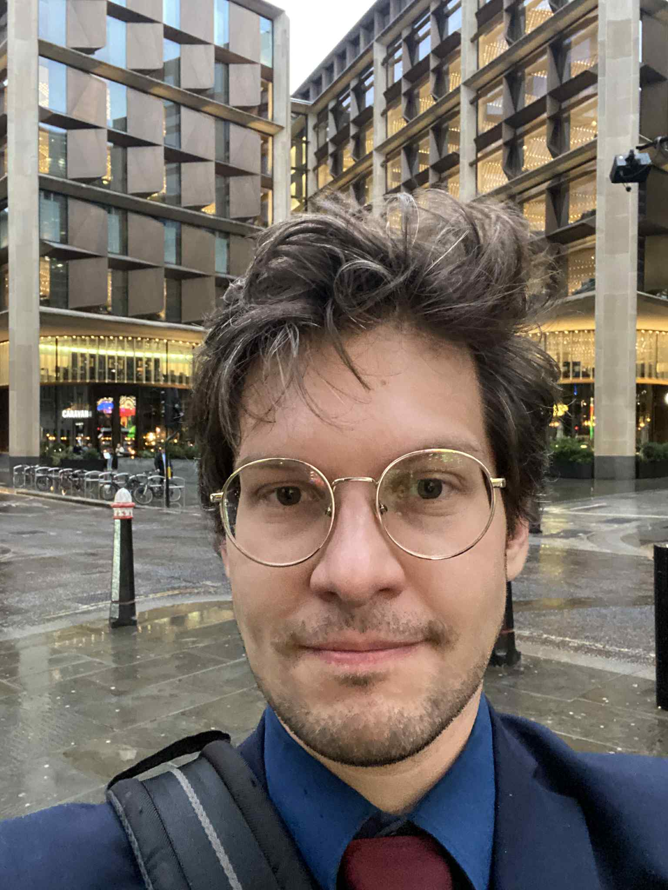
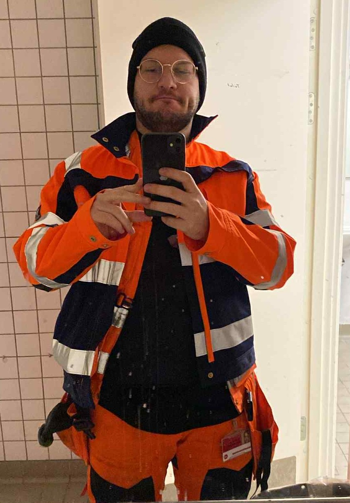
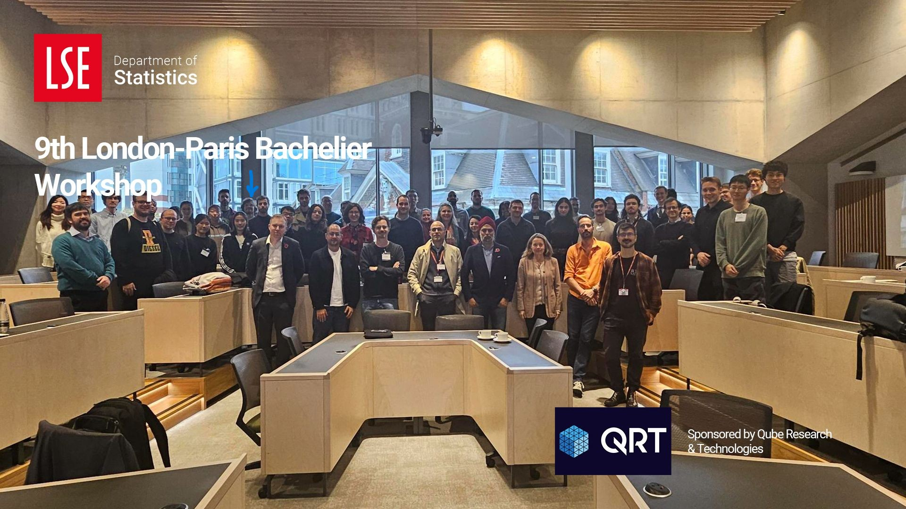
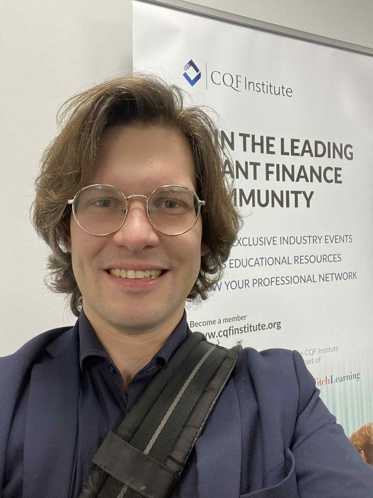
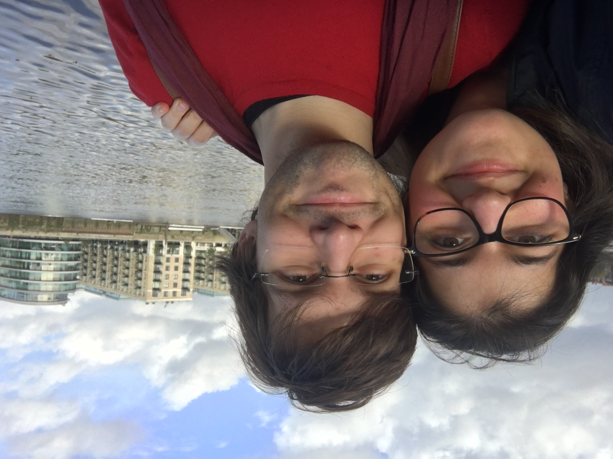

## Who I Am

My name is Mark Březina.

My family name most likely traces back to Březina in what is now the Czech Republic, and to Slavic roots. My family fled Prague following the 1968 Soviet invasion, and we have lived in Copenhagen, Denmark ever since.

In 2025, I moved to London to build a life with my partner and pursue a visa route through that relationship. Since then, I have been looking for work in the UK.
 

  

## My Background

My background has been anything but straightforward.

I originally wanted to become a painter, but my family strongly opposed that path. I was effectively told to either leave home or choose a more conventional career. So I turned toward science.

In high school, I was denied access to Physics A-level, so I had to complete it through an intensive summer course, compressing a year of material into four weeks.

I began studying physics, then later shifted toward mathematics because I saw a more realistic path into quantitative finance and, frankly, financial stability.

At the same time, I was in a long-distance relationship with my current partner. During high school, I regularly worked around 45 hours a week while studying in order to afford tickets and hotel stays so we could see each other. I kept doing that for years, up until my move to the UK.

Because of work, finances, and life circumstances, I have had to pause my degree multiple times. It is currently on hold again while I try to find work in the UK, save money, and eventually finish it.

Along the way, I have worked in bookkeeping, data quality for IRB-related work, teaching, and quantitative development.\
And below is a picture of my recent position as a train station cleaner.

  

## Why I Care About the Competition

I first came across IMC Prosperity by accident in late March 2025.

At the time, I had sneaked into Imperial College London to hear Daniel Lacker speak about mean field theory. I had been searching everywhere for talks and seminars on mean field theory because I had come across the idea that firms such as Jane Street were using ideas related to mean field games to better understand market participant behaviour.

At Imperial, I saw a poster for IMC Prosperity and decided to join for fun.

Since then, I have come to feel that IMC’s competition format is one of the closest approximations to the real thing available publicly. I use it partly as a competition, but also as a kind of backtesting environment with a scoreboard attached. It helps me test whether I have actually built something useful.

I am currently working on a 4GB laptop with very limited storage and compute power, so scaling is a real constraint. IMC gives me a way to experiment without exhausting my own hardware.

Beyond that I am in general engaged in all things quant, IMC Prosperity is a great opportunity to actually participate, beyond simply attending seminars and talks.

A picture of me signing up and participating at the 9th London–Paris Bachelier Workshop in 2025.

  

## What Kind of Trader / Researcher I Am

Because I come from a physics background, I naturally look at markets through the lens of dynamics: fluid flow, particle systems, aggregation, and interacting agents. That is also what led me toward mean field theory in the first place.

My thinking and research are heavily dynamics-driven. Where I am weaker is in formal economics and game theory.

More generally, I tend to think in terms of systems, complexity, and mechanisms rather than memorisation or convention. That also means I sometimes struggle to be concise, standardised, or “normal” in how I explain things.

  

## What This Repo Is Trying to Do Differently

The main goal of this repo is to provide the kind of support I wish I had had when I started.

I want to share as much useful help as I can without giving away my own edge or core research. My hope is to build the kind of high-quality material I would have loved to find when I was starting out.

## My Philosophy on Learning / Alpha / Sharpe / Robustness

A lot of people come into quant drawn by the mathematics, the complexity, and, of course, the money.

As someone who has spent much of life below the poverty line, I can say this very clearly: a stable salary, peace of mind, and basic security are worth more than most people realise.

I have been chasing quantitative finance for close to a decade, and I have been turned away repeatedly. I did not have “economics” or “finance” in the title of my degree, so I could not get internships. I was treated as if I were pretending. Family and friends often saw what I was doing as worthless because it did not come with an immediate salary.

That is why you will see me recommend curiosity, persistence, and genuine interest so often. I know firsthand that dedication and intelligence do not automatically lead to opportunity. In many cases, access still depends on family background, money, networks, or elite institutions.

That is unfortunate, but it is part of the reality.

## Links to My GitHub / LinkedIn / Contact

My GitHub is here:  
[https://github.com/MarkBrezina](https://github.com/MarkBrezina)

My LinkedIn is still online, but I am no longer actively using it. After a year of relentless applications and very little return, I have stepped back from it and am now applying more broadly for work, including bartending, waitering, and cleaning roles.

You are welcome to send a message, like, or connection request, but I may not respond:  
[https://www.linkedin.com/in/markbrezina95/](https://www.linkedin.com/in/markbrezina95/)

If you have something genuinely worthwhile for both of us, you can contact me here:  
**mark@brezina.dk**

## About the Author

I regularly attend CQF events, London Quant Group events, and any other quant-related events in London that I can access, especially when they are free.

If I had the finances for it, I would finish my bachelor’s degree in mathematics and likely continue toward a master’s and PhD, probably in dynamical systems, electromagnetism, or a related field.

I originally wanted to be a painter, but I was told that if I did not pursue a “valuable” career, I could live on the street. Instead, I studied parts of a physics degree, especially mathematical physics, and parts of a degree in mathematical statistics, with a focus on financial mathematics, statistics, and probability.

I participated in IMC Prosperity 3, where my team finished **#107 globally**.

I also regularly take part in **Børsens Aktiedyst**, a portfolio management competition in Denmark. I have not yet placed below the top 10%, though I only began documenting my results last year.

I am a member of Mensa and have previously been involved in various “highly talented” communities in Denmark. That said, it was only after moving to London that I gained more direct exposure to things like maths olympiad circles, quant networking events, and programming communities.

Denmark is a very small country. Despite what current headlines may suggest, the scale is tiny compared with places like London, Delhi, or New York. The quant scene in Denmark is correspondingly small: a couple of banks, some pension institutions, and a handful of energy trading firms, helped by the country’s geographic position between Norway, Sweden, Germany, and the broader Nordic and European markets.

How long have I wanted to work in quantitative finance? Around 10 years.

Progress has been slow because of persistent financial pressure. I have spent long stretches in poverty, to the point where I could not afford to repair or replace broken essentials such as my phone, clothes, or computer.

I need to produce around **£2,000 per month**, and nearly all of it goes to rent, food, and bills. Right now, I am struggling to find stable work, so that pressure never really goes away.

I have worked good jobs and bad jobs simply to survive.

For now I am trying my best to stay together with my partner in London.

  

