If you have just joined the Discord or created your account on the IMC Prosperity website, this page will help you get set up with the very basics.

Here are the first questions most people have:

1. [How do I set up my first trader?](#how-do-i-set-up-my-first-trader)
2. [How do you build your trader?](#how-do-you-build-your-trader)
3. [How do you figure out whether you are performing well?](#how-do-you-figure-out-if-you-are-performing-well-at-all)
4. [How do you improve from a very early submission?](#how-do-you-get-from-a-very-early-submission-into-improving-your-performance)
5. [How do you learn algorithmic trading in the short time you have?](#how-do-you-learn-anything-about-algorithmic-trading-in-the-short-time-you-have)
6. [Other questions you might have](#all-the-other-questions-you-might-have)

## How do I set up my first trader?

### Step 1: Open the website

If you are new to the IMC Prosperity Challenge, this is usually the first page you will see.

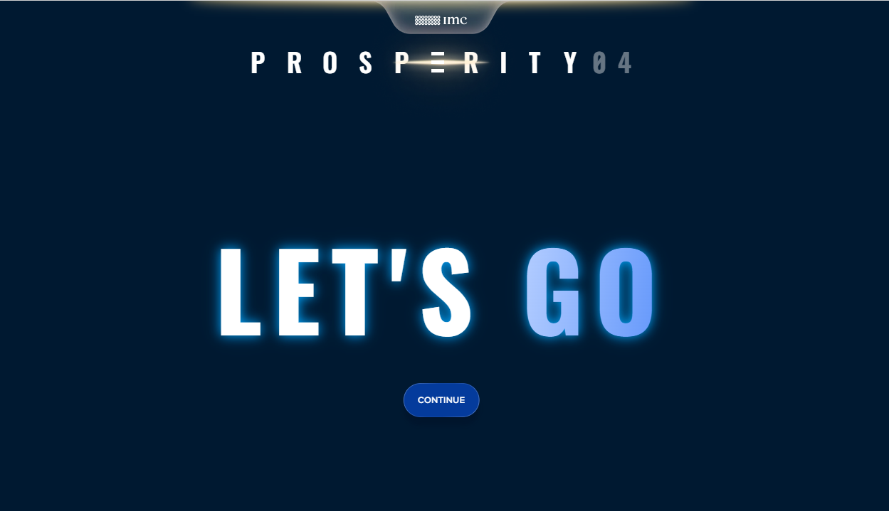

After signing up, choosing your advisor, and logging in, click **Continue** to move to the initial interface.

> **Note:** your advisor choice is purely cosmetic and does not affect your results.

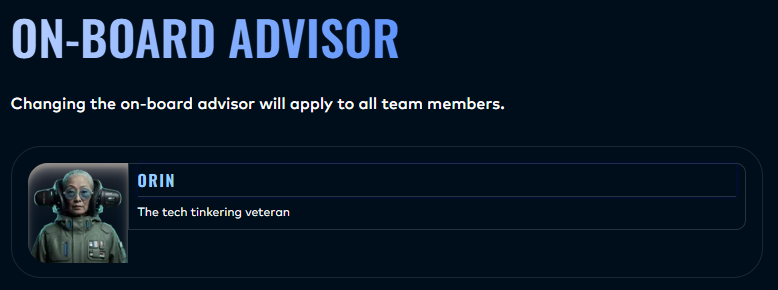

### Step 2: Start the tutorial

You will then see a countdown timer. When it becomes available, click **Start Mission** to enter the challenge interface.

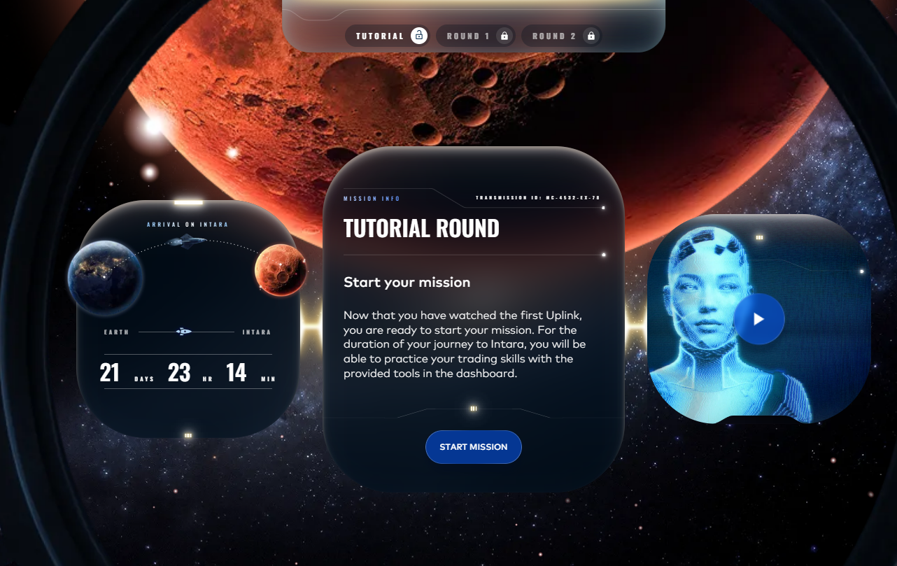

### Step 3: Open the challenge interface

After clicking **Start Mission**, you will arrive at the **Algorithmic Challenge** interface.

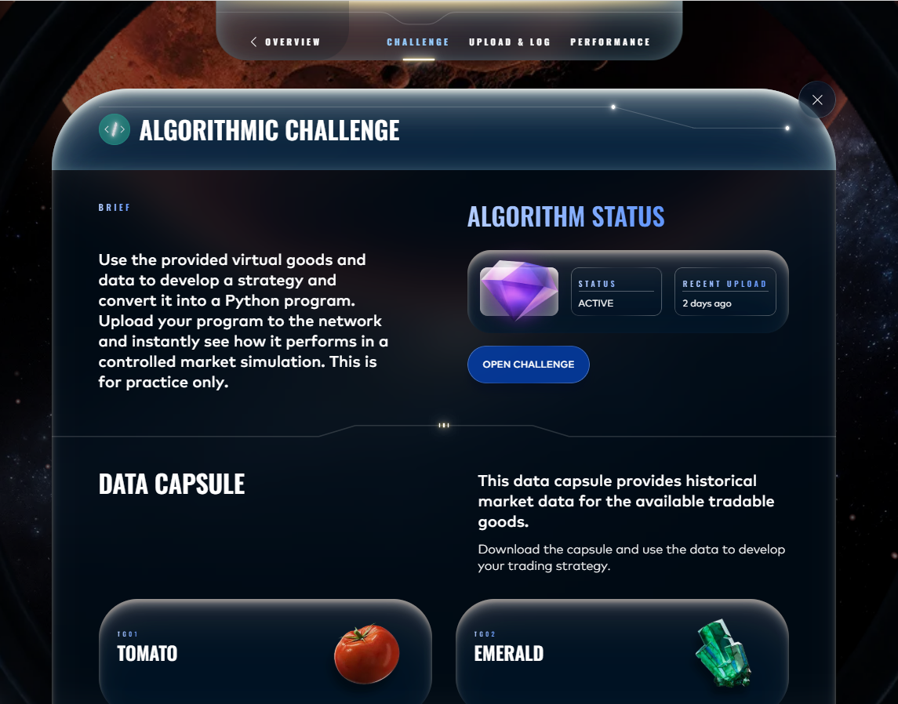

From here, you have two main options:

- click **Open Challenge** to upload your trading strategy
- scroll down to download the **data capsule** for products such as **Emeralds** and **Tomatoes**

The data capsule is useful for research, idea generation, and building your first trading strategy.

Clicking **Open Challenge** takes you to the upload page, where you can submit your trading file. Your submission must be a Python file ending in `.py`.

### Step 4: Upload your first trader

If you do not yet have a trader file ready, here is a finished [example file](https://github.com/MarkBrezina/Ctrl-Alt-DefeatTheMarket2/blob/main/trader%20architecture/Trader.py) that you can download and upload.

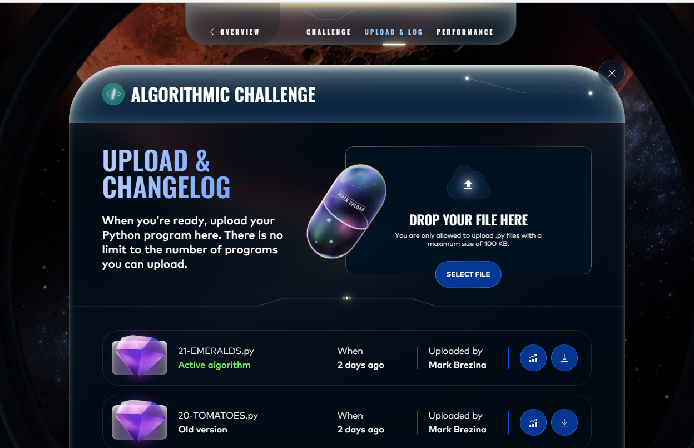

After uploading a trader file, you will be able to view performance output such as graphs and results. You can also compare multiple uploads to see which strategy performed best.

### Step 5: View the results and graph

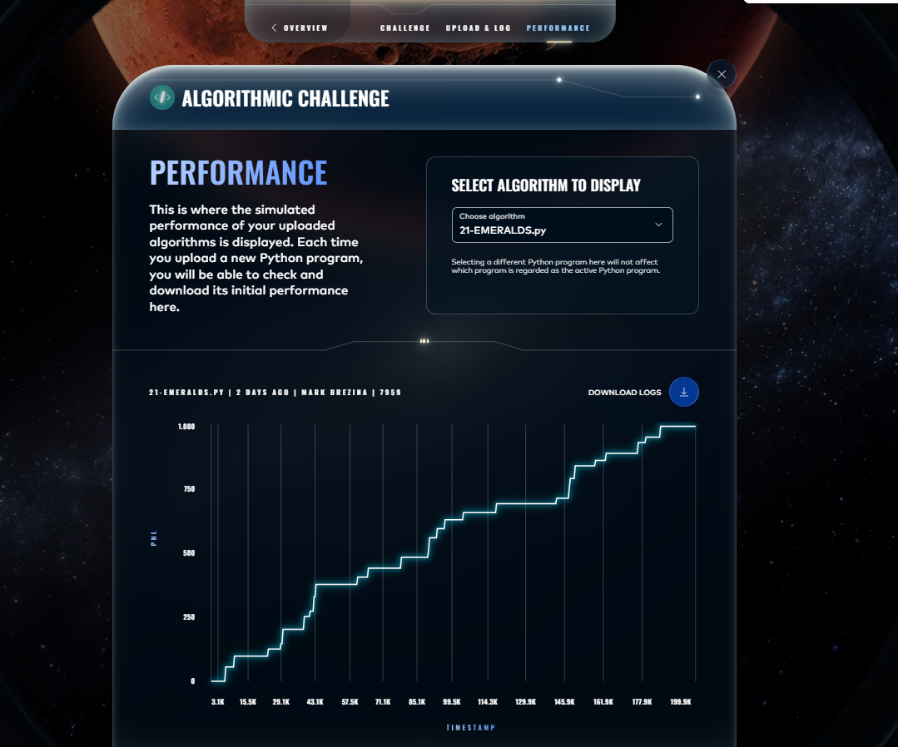

After uploading your `trader.py` and reviewing the result, you can also open the side menu for more resources.

I strongly recommend reading the **Wiki** before writing too much code.

If you would rather start by socialising and chatting with other participants, head over to the [Discord server](https://discord.com/channels/1001852729725046804/1476867246000177162).

### Step 6: Open the side menu

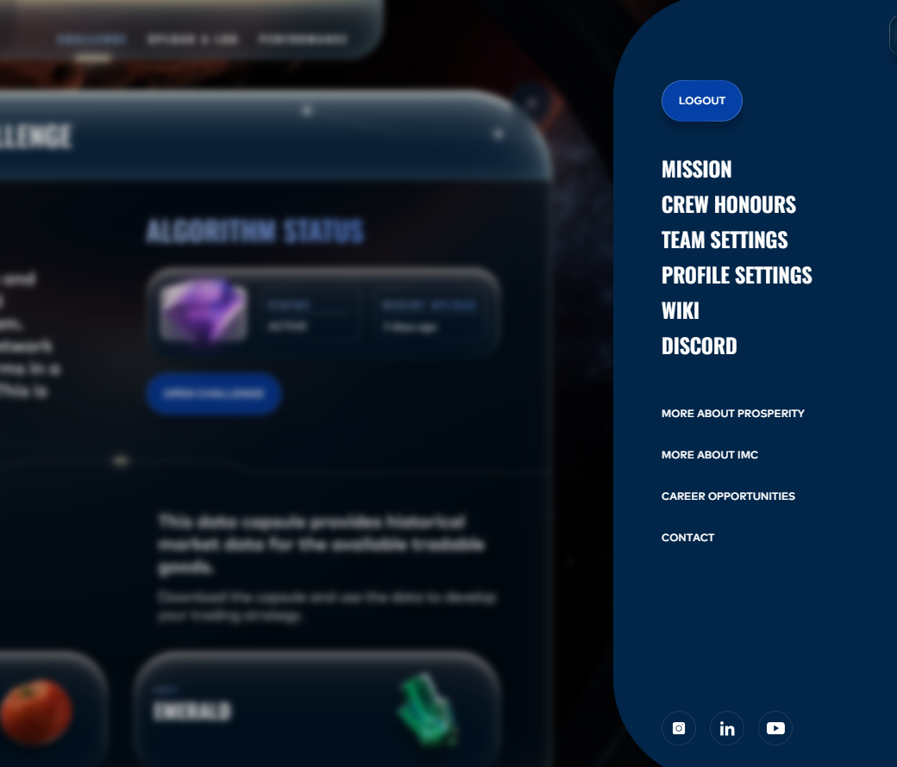

The **Wiki** contains important information about each round, the products, and the overall challenge structure. It is worth reading carefully before you start coding.

> **Note:** you will also see a **Crew Awards** section. As Jasper explained, this is used for players and teams to earn badges that celebrate milestones within the game, as described in the [game mechanics overview](https://imc-prosperity.notion.site/game-mechanics-overview).

### Step 7: Read the Wiki

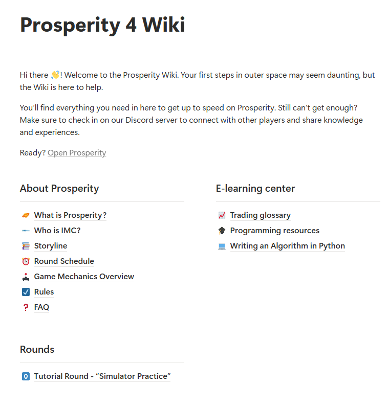

The Wiki contains IMC’s own walkthroughs and explanations of the challenge.

You can think of this repo as a companion guide that builds on and reiterates what IMC has already put out.

As the challenge progresses, you will see more tabs appear under **Rounds**, with additional details for each round.

> **Note:** there is usually an intermission of a few hours between rounds while scores are calculated. Data capsules are released when the next round opens.


<br>
<br>
<br>
<br>
<br>
<br>


## How do you build your trader?
This section focuses on the technical side of the challenge: how to start coding your trader.

A good first step is choosing a Python development environment. A few common options are **Visual Studio Code**, **PyCharm**, **Jupyter Notebook**, and **Spyder**.

I personally use **Jupyter Notebook** for research and **Spyder** for putting the trader together. I installed both through **Anaconda**, which is also a good option if you want an easy setup.

Some useful tools:

- [Visual Studio Code](https://code.visualstudio.com/) — my main recommendation for most people
- [Anaconda Navigator](https://www.anaconda.com/products/navigator) — useful if you want access to Jupyter Notebook and Spyder
- [PyCharm](https://www.jetbrains.com/pycharm/) — a popular Python IDE, especially if you prefer a more full-featured development environment

To get started, IMC provides its own walkthrough of the basic architecture and system setup here:

[Writing an Algorithm in Python](https://imc-prosperity.notion.site/writing-an-algorithm-in-python)

Below is the basic starter template provided by IMC:

```python
from datamodel import OrderDepth, UserId, TradingState, Order
from typing import List
import string

class Trader:

    def bid(self):
        return 15
    
    def run(self, state: TradingState):
        """Only method required. It takes all buy and sell orders for all
        symbols as an input, and outputs a list of orders to be sent."""

        print("traderData: " + state.traderData)
        print("Observations: " + str(state.observations))

        # Orders to be placed on exchange matching engine
        result = {}
        for product in state.order_depths:
            order_depth: OrderDepth = state.order_depths[product]
            orders: List[Order] = []
            acceptable_price = 10  # Participant should calculate this value
            print("Acceptable price : " + str(acceptable_price))
            print(
                "Buy Order depth : " + str(len(order_depth.buy_orders)) +
                ", Sell order depth : " + str(len(order_depth.sell_orders))
            )
    
            if len(order_depth.sell_orders) != 0:
                best_ask, best_ask_amount = list(order_depth.sell_orders.items())[0]
                if int(best_ask) < acceptable_price:
                    print("BUY", str(-best_ask_amount) + "x", best_ask)
                    orders.append(Order(product, best_ask, -best_ask_amount))
    
            if len(order_depth.buy_orders) != 0:
                best_bid, best_bid_amount = list(order_depth.buy_orders.items())[0]
                if int(best_bid) > acceptable_price:
                    print("SELL", str(best_bid_amount) + "x", best_bid)
                    orders.append(Order(product, best_bid, -best_bid_amount))
            
            result[product] = orders
    
        # String value holding Trader state data required. 
        # It will be delivered as TradingState.traderData on next execution.
        traderData = "SAMPLE"
        
        # Sample conversion request. Check more details below.
        conversions = 1
        return result, conversions, traderData
```
If you simply want a working file that you can download and upload immediately, use this one: [Trader.py](https://github.com/MarkBrezina/Ctrl-Alt-DefeatTheMarket2/blob/main/trader%20architecture/Trader.py)

Submitting that code should give you a basic PnL graph like this:
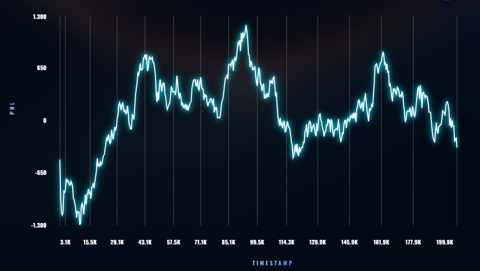

After submitting and checking over the graph. you may wish to continue onward with your journey.
<br>

If you want to understand how the code works in more detail, head over to the relevant [architecture section]() of the repo. It is more advanced, so it may not make full sense on a first read. \
<br>
If you want to learn Python itself, a simple place to start is [W3Schools - Python](https://www.w3schools.com/python/default.asp) \
If you would rather plug something in and start experimenting straight away, there are also ready-to-use files [here](https://github.com/MarkBrezina/Ctrl-Alt-DefeatTheMarket2/tree/main/market_basics)


## How do you figure out if you are performing well at all?
The main metric used on the IMC website is **PnL**. In practice, the teams with the strongest PnL will usually move further up the scoreboard and into later rounds.

That said, raw PnL is not the whole story.

After a discussion with Tomas from the IMC team, I wanted to add an important note here: \
While the visible competition metric is highest profit, what most people are really aiming for is **high profit with as little risk as possible**.

That is why you will often see people in the Discord server, and in trading more broadly, talk about **Sharpe** and **drawdown**, not just profits or returns.

So yes, you should care about PnL. But it is also worth paying attention to how that PnL is earned:

- Is the curve relatively smooth?
- Does the strategy suffer large drawdowns?
- Is the profit consistent, or is it coming from a few lucky spikes?

A trader that earns slightly less money but does so with much smaller drawdowns is often a much better strategy than one with a more violent and unstable equity curve.

Here are two simple examples to illustrate the point.

### High PnL, high max drawdown
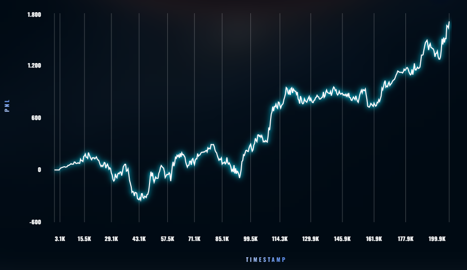

### High PnL, low max drawdown
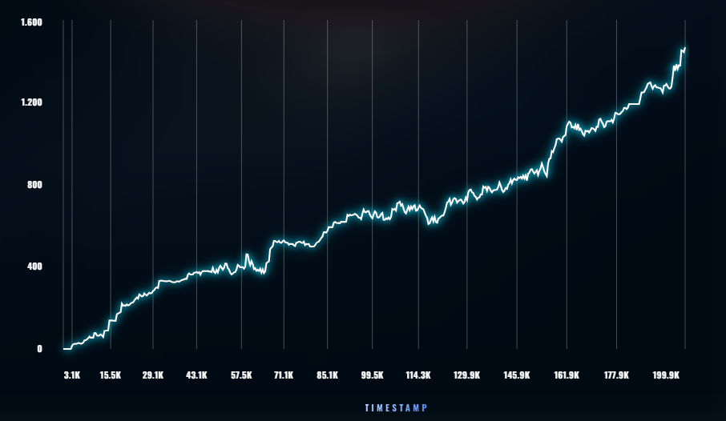

After looking at these two graphs, the idea should hopefully be clear. Even if the second graph does not reach 1800, it still earns around 1600 while doing so with significantly smaller swings and a much smoother upward path.

That kind of behaviour is often much easier to trust, improve, and build on.

### Backtesting

To improve quickly, most participants will spend a lot of time **backtesting**. Backtesting simply means testing your ideas and your code on a simplified model of the market.

These backtests are useful, but they do **not** always match the final PnL graph you will see on IMC’s website.

For example, a local backtester might show a result like 36,000, while the same trader might only produce 2,800 on the IMC site. That is fairly normal. Different backtesters make different assumptions, handle fills differently, and may simplify parts of the market.

Because of that, the IMC website is still the most reliable benchmark. The trade-off is that it is slower, so it is harder to use for rapid iteration.

There are several useful public backtesters and tools:

- [Geyzson's Rust backtester](https://github.com/GeyzsoN/prosperity_rust_backtester)
- [IMC Prosperity 4 Visualizer](https://kevin-fu1.github.io/imc-prosperity-4-visualizer/?/visualizer)
- [Jasper's backtester from IMC 3](https://github.com/jmerle/imc-prosperity-3-backtester)
- [Chris Roberts' IMC 4 Monte Carlo backtester](https://github.com/chrispyroberts/imc-prosperity-4)

If you want to go further beyond Prosperity, you can also explore broader backtesting libraries such as [VectorBT](https://vectorbt.dev/), [backtesting.py](https://kernc.github.io/backtesting.py/), and [Backtrader](https://www.backtrader.com/).

IMC does not recommend any specific backtester. Jasper’s backtester is from Prosperity 3, but it can still be a useful tool.

I personally also use [equirag](https://prosperity.equirag.com/) and [vercel](https://imc-prosperity-visualizer.vercel.app/) as an additional check, especially when I want to inspect inventory positions and signal behaviour more carefully.


## How do you get from a very early submission into improving your performance?

Getting from the basic starter trader to a genuinely better strategy usually requires three things to go right.

1. **You need a basic understanding of the challenge and the market environment.**  
   You do not need to know everything, but you do need at least a rough understanding of what kind of market you are interacting with and what the data is showing you.

2. **You need an idea for how the trader might make money.**  
   This is where trading ideas begin to matter. For example, you might believe that prices tend to revert back toward a mean, or that prices sometimes drift upward or downward for a period of time.

3. **You need to turn that idea into code that works in practice.**  
   It is one thing to say “buy low, sell high” or “sell high, buy back lower.” It is another thing to implement that logic in a way that actually behaves well in the challenge.

The basic starter trader uses a very simple rule:

- if the current lowest sell price is below 10, it buys
- if the current highest buy price is above 10, it sells

At its core, this is just a simple **buy low, sell high** idea.

But once you try to improve on that, a few deeper questions start to matter:

- What do **bid** and **ask** actually mean?
- Do you want to trade immediately against existing orders, or place your own orders and wait to be filled?
- Do you want to approach buyers and sellers with better prices, or only trade when the market comes to you?
- How do you turn those choices into actual trading logic?

Those are exactly the kinds of questions you will spend most of your time working on.

Improvements can be made at every level. Even if two people have the same broad idea, the one who understands the market better, implements the logic more clearly, and turns it into cleaner code will usually end up with the stronger trader.

If you are still figuring out the basics, head over to the **Glossary**.

If you already understand the basic terms, move on to **Indicators**.

If you have both of those down, the next step is the **Trader Architecture** section.

## How do you learn ANYTHING about algorithmic trading in the short time you have?

There are a huge number of resources out there if you are willing to spend some time looking for them.

Below is an initial list of strong previous participants, their public code, and some of the ideas and approaches they shared. You can also work through this repository using the suggested reading paths, depending on how much background knowledge you already have.

More broadly, it is worth being realistic: you are not going to learn everything about trading, programming, and market research in the short time that IMC Prosperity is running.

That is one of the reasons why teaming up with others is such a good idea.

A team lets people specialise, just as they do in trading firms. In broad terms, the work often splits into three areas:

- **Execution, operations, inventory, and risk**  
  This is the side focused on how trades are placed, how positions are managed, and how the trader behaves in practice.

- **Research, alpha, and optimisation**  
  This is the side focused on finding trading ideas, building signals, testing hypotheses, and improving performance.

- **Software, infrastructure, and compute**  
  This is the side focused on code quality, system structure, tooling, backtesting, and overall implementation.

You will find resources in this repository and elsewhere that are especially useful for each of these areas. This is closely related to the three-part structure mentioned earlier: understanding the environment, forming an idea, and implementing it properly.

It is absolutely possible to make progress by borrowing ideas or even adapting parts of previous public solutions.

But there is a limit to how far simple plug-and-play will take you.

As soon as the challenge presents something unfamiliar, people who only copied code tend to struggle. That is why I strongly recommend reading previous solutions carefully and trying to understand **why** they work, not just copying them and hoping for the best.

### List of previous high ranking submissions.

**Prosperity 1:** \
2nd place: https://github.com/ShubhamAnandJain/IMC-Prosperity-2023-Stanford-Cardinal \
57th place: https://github.com/MichalOkon/imc_prosperity \
91st place: https://github.com/nicolassinott/IMC_Prosperity \
322nd place: https://github.com/jmerle/imc-prosperity 

**Prosperity 2:** \
2nd place: https://github.com/ericcccsliu/imc-prosperity-2 \
9th place: https://github.com/jmerle/imc-prosperity-2 \
13th place: https://github.com/pe049395/IMC-Prosperity-2024 \
124th place: https://github.com/cpartridge18/prosperity-24 \
332nd place: https://github.com/edmund870/2024-IMC-Global-Trading-Challenge \
368th place: https://github.com/AcreixYuan/IMC-Prosperity-2 \
381st place: https://github.com/davidteather/imc-prosperity-2024 \
489th place: https://github.com/stephen-w-choo/imc-prosperity-2024

**Prosperity 3:** \
2nd place: https://github.com/TimoDiehm/imc-prosperity-3 \
7th place: https://github.com/chrispyroberts/imc-prosperity-3 \
9th place: https://github.com/CarterT27/imc-prosperity-3 \
10th place: https://github.com/YBansal95/imc-prosperity-3 \
19th place: https://github.com/JackRao123/prosperity-crushers \
24th place: https://github.com/awatatani/imc-prosperity3-trading \
25th place: https://github.com/jmerle/imc-prosperity-3 \
29th place: https://github.com/musashi-island/prosperity3 \
44th place: https://github.com/angus4718/imc-prosperity-3-public \
60th place: https://github.com/FumeiYoruu/imc-prosperity-3 \
89th place: https://github.com/ZainAlSaffi-Dev/imc-prosperity3 \
109th place: https://github.com/Sylvain-Topeza/imc-prosperity-3 \
131st place: https://github.com/JamesCole809/IMC-Prosperity-3 \
141st place: https://github.com/Akezh/imc_trading_2025 \
168th place: https://github.com/aahiill/IMC-Prosperity-3 \
172nd place: https://github.com/KengLL/Prosperity-3-Neko (2nd in manual) \
238th place: https://github.com/milesmitchell/imc_prosperity_3 \
287th place: https://github.com/JohnnyTung123/imc-prosperity-3 

**Optiver Realized volatility prediction:** <br>
1st place: https://www.kaggle.com/competitions/optiver-realized-volatility-prediction/writeups/nyanp-1st-place-solution-nearest-neighbors \
3rd place: https://www.kaggle.com/competitions/optiver-realized-volatility-prediction/writeups/pksha-life-is-volatile-tentative-3rd-place-solution \
xth place: https://github.com/taher-software/Optiver-Realized-Volatility-Prediction/tree/master

**Optiver Trading at the close:** \
1st place: https://www.kaggle.com/competitions/optiver-trading-at-the-close/writeups/hyd-1st-place-solution \
9th place: https://www.kaggle.com/competitions/optiver-trading-at-the-close/writeups/adam-9th-place-solution \
xth place: https://github.com/liyiyan128/optiver-trading-at-the-close \
yth place: https://fan2goa1.github.io/mkdocs-material/blog/2023/12/24/kaggle-optiver---trading-at-the-close

General option pricing: https://github.com/Robin-Guilliou/Option-Pricing \
General microstructure pricing: https://github.com/xhshenxin/Micro_Price

[link](https://github.com/MarkBrezina/Ctrl-Alt-DefeatTheMarket2/blob/main/RESOURCES.md)


## All the other questions you might have
For broader questions about how the competition works, either head to the page most relevant to your question or return to the main page.

### How do I find teammates or a team?

You can look for teammates through the Discord server here:

[Find teammates on the Discord channel](https://discord.com/channels/1001852729725046804/1476867465601355851)

Do also consider the following [page](https://github.com/MarkBrezina/Ctrl-Alt-DefeatTheMarket2/blob/main/TEAMMATES_AND_ROLES.md) on how most teams and algorithmic trading shops are put together.

### Am I eligible for prizes?

For questions about your eligibility, or your team’s eligibility, check the official terms and conditions and the FAQ first.

If you are still unsure, email **prosperity@imc.com**. That address is monitored by someone who can answer eligibility-related questions.

[Am I eligible for prizes?](https://imc-prosperity.notion.site/faq#328e8453a09380148e01da499c63adb0)

### Are there in-person meetups?

There are no fixed global in-person meetups, but there are sometimes local events and meet-and-greet opportunities.

For example, India has had a few meetups this year, likely because last year’s winners were from India.

There will also be an online webinar on **9 April**:

[Sign up here](https://job-boards.eu.greenhouse.io/imc/jobs/4790350101?gh_src=tt0n71b2teu)

### Do conversions matter this year?

This year, the `conversions` value included in the base trader function does **not** play a role. You can therefore safely ignore it for now.

In previous years, conversions mattered because some rounds involved multiple exchanges and different currencies.

For example, imagine the following:

- trading 10 seashells on one exchange gives you 10 Sun Coins
- trading 10 seashells on another exchange gives you 15 Peninsula Coins
- converting 15 Peninsula Coins gives you 11 Sun Coins

In that kind of setup, conversions matter because they affect whether trading across exchanges is actually profitable after accounting for the exchange rate.

That is why the field is called `conversions`.

### How do I prepare mentally?

The best mindset I have found is curiosity.

You will fail many times, both in small ways and large ones. That is normal. The challenge is much easier to handle if you treat it as something to explore rather than something you must already be good at.

A second point is simple: stay respectful.

If you spend your time trying to impress people, argue aggressively, or act like you know everything, others will usually cut that down quickly. And if you push it too far, you may end up banned from the Discord server or from the competition itself.

There is a [separate page](https://github.com/MarkBrezina/Ctrl-Alt-DefeatTheMarket2/blob/main/MINDSET.md) dedicated to the mental side of the challenge, because this is something that affects both strong participants and weaker ones.


### Will it be hard?

Yes.

In some ways, Prosperity gives you access to resources and learning opportunities that many real-world quants do not get so easily.

At the same time, you are under significant time pressure.

One of the hardest parts of the challenge is that you are trying to compress the full quant process into a very short period of time:

- understanding the market
- generating ideas
- coding a trader
- testing it
- debugging it
- improving it under pressure

You are not competing against the biggest quant firms in the world, but you are competing against people who may find resources faster, implement ideas faster, or simply have more experience already.

That can make the challenge intense, but it is also what makes it valuable.


