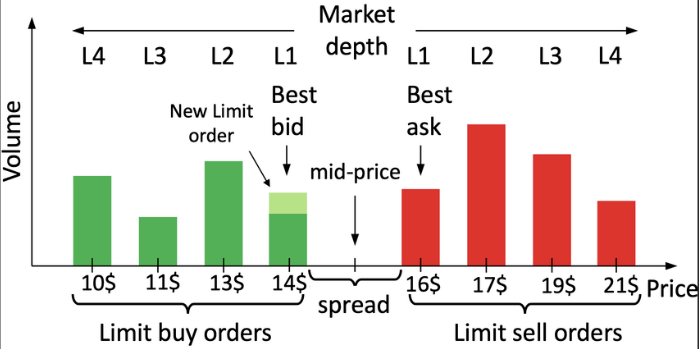
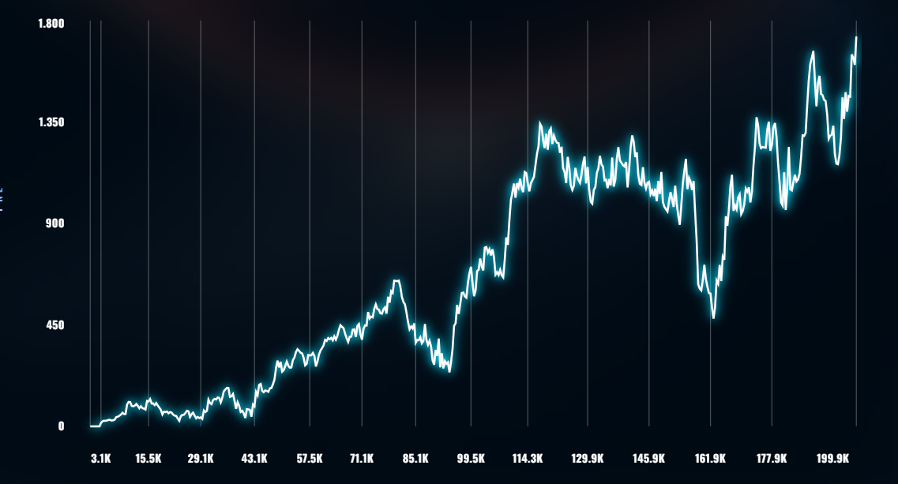
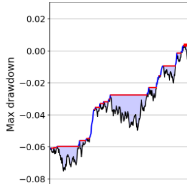
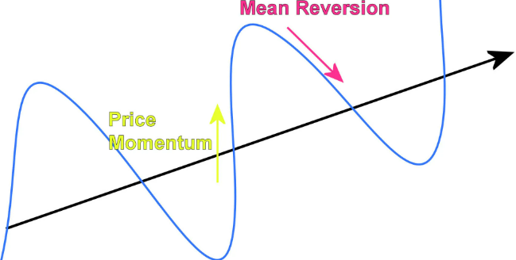
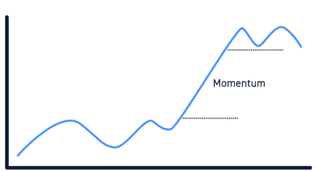
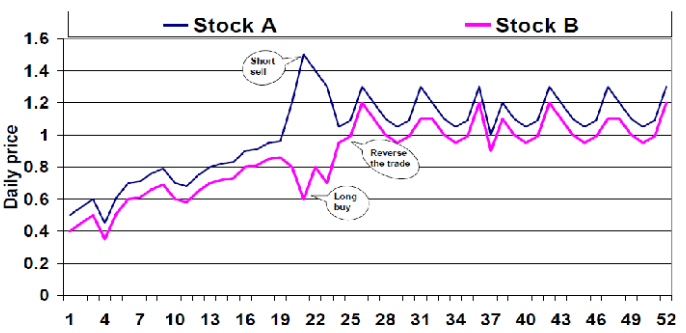
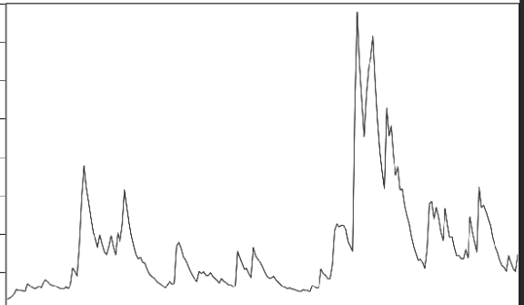

# Trading Glossary

Much of this glossary is adapted from the [IMC Wiki Trading Glossary](https://imc-prosperity.notion.site/trading-glossary), with added notes to make the ideas easier to understand in the context of the Prosperity challenge.

The aim of this page is to introduce players to trading concepts and jargon that appear both in real-world markets and in IMC Prosperity

## Order Books and Markets

### Order Book

The **order book** is the list of active buy and sell orders currently in the market.

In Prosperity, you interact with a **limit order book**. This means participants submit orders at specific prices where they are willing to buy or sell. In wider markets, you may also see terms such as **LOB** (Limit Order Book), **CLOB** (Central Limit Order Book), or **Level 3 / L3** data for more detailed order-level information.

  <strong>LOB illustration</strong> 
   
  

### Bid

A **bid** is a buy order. It shows the price a buyer is willing to pay, together with the quantity they want to buy.

In auction terms, the bid is simply the buyer’s offer.

### Ask

An **ask** is a sell order. It shows the price a seller is willing to accept, together with the quantity they want to sell.

You may also hear this called an **offer.**

### Spread

The **spread** is the difference between the **best bid** and the **best ask.**

- **Best bid** = the highest active buy price
- **Best ask** = the lowest active sell price

The spread matters because it represents the gap between buyers and sellers. Many market-making strategies aim to earn this spread by buying near the bid and selling near the ask.

### Mid Price

The **mid price** is the price halfway between the best bid and the best ask.

$$
\text{Mid Price} = \frac{\text{Best Bid} + \text{Best Ask}}{2}
$$

It is often used as a reference price for where the market currently is. Trades do not have to happen exactly at the mid.

### Fair Value

**Fair value** is your estimate of what an asset is actually worth right now.

The current market price may not always reflect that value perfectly. For example, the market may trade at 100 now, but if your model suggests the asset should really be worth 102, then your fair value estimate is 102.

Much of trading is about estimating fair value better than the market.

### Maker

A **maker** is a participant who **adds liquidity** to the market by placing a resting limit order that does not execute immediately.

That order sits in the book and waits for someone else to trade against it.

### Taker

A **taker** is a participant who **removes liquidity** from the market by submitting an order that executes immediately against resting orders already in the book.

This is usually done with a market order or an aggressive limit order that crosses the spread.

### Fill

A **fill** happens when your order is matched with an order on the opposite side of the market.

For example, if you place a buy order and a seller is available at that price, your order is filled. In Prosperity, posting an order does not guarantee that it will be filled.

### Order Book Imbalance

**Order book imbalance** refers to one side of the book being heavier than the other.

For example:

- more buy size than sell size can suggest upward pressure,
- more sell size than buy size can suggest downward pressure.

This is often used as a short-term market signal.

### Order Flow

**Order flow** is the stream of orders, cancellations, and trades entering the market over time.

While imbalance tells you what the book looks like now, order flow tells you how it is changing.

### Queueing

**Queueing** refers to the fact that if several orders rest at the same price, some are ahead of others in line.

Most exchanges, including Prosperity’s exchange, use **price-time priority:**

- better prices are matched first,
- if prices are equal, older orders are matched first.

This matters a lot for passive trading. Even if you place an order at a good price, you may still have to wait behind earlier orders at that same price level.

## Orders and Matching
### Order

An **order** is a message sent to the exchange saying that you want to buy or sell a product under certain conditions.

The key parts of an order are usually:
- **product**
- **side** (buy or sell)
- **quantity**
- **price**
- **validity**

In Prosperity, the main order type you work with is the **limit order.**

### Market Order

A **market order** is an order to buy or sell immediately at the best currently available prices.

### Limit Order

A **limit order** is an order to buy or sell at a specified price or better.

- A buy limit order will only trade at that price or lower
- A sell limit order will only trade at that price or higher

### Stop Order

A **stop order** is an order that only becomes active once the market reaches a certain trigger price. After that, it is usually sent as a market order.

This is a general market concept and is less central to Prosperity than limit orders.

### Order Matching

Orders trade when a buy order and a sell order are compatible.

For example:
- a buy order at 100 can trade with a sell order at 100 or lower,
- a sell order at 100 can trade with a buy order at 100 or higher.

If an order is only partly matched, the remaining quantity may stay in the book as a resting order.

## Prosperity Simulation Notes

One question that comes up often is how the simulation timeline works.

A useful working interpretation is:

1. You observe the visible market state.
2. Your trader submits orders.
3. Your orders are matched immediately against the visible book.
4. Other activity may happen after your turn.
5. The next visible state reflects the result of that later activity.

A few practical consequences:

- if your order can be matched immediately, it is matched immediately,
- if part of your order remains in the book, there is no guarantee it will still be visible to you later,
- other bots may act after your trader,
- some later orders may never appear in the visible book if they are placed and resolved within the same iteration.

So when people talk about **queueing, resting orders**, or **fill probability**, this is why it matters.

## Algorithmic Trading

### Inventory

Your **inventory** is the position you currently hold in an asset.

For example, if you buy 10 EMERALDS, your inventory in EMERALDS becomes +10.

Inventory matters because holding too much of one asset creates risk. In Prosperity, each product has a position limit, so you must manage inventory carefully.

### Execution

**Execution** is the practical side of turning a trading idea into actual trades.

This includes deciding:

- when to trade,
- how aggressively to trade,
- at what price to trade,
- and how to minimise unnecessary cost or impact.

A strategy can have a good signal and still perform badly if execution is poor.

### PnL — Profit and Loss

**PnL** stands for **profit and loss.**

It measures how much money your strategy has made or lost through its trading activity. In Prosperity, this is one of the main outcomes you care about.

Here is an illustration of a PnL graph. \

### Edge

Your **edge** is the advantage your strategy has over the market or over other participants.

This could come from:
- better price prediction,
- better fair value estimation,
- better execution,
- better inventory control,
- or better risk management.

In simple terms, your edge is the reason your strategy should make money.

### Sharpe Ratio

The **Sharpe ratio** measures return relative to risk.

A common simplified version is:

$$\text{Sharpe Ratio} = \frac{\text{Strategy Return} - \text{Benchmark or Risk-Free Return}}{\text{Volatility of Returns}}$$

The goal is not just to make money, but to make money consistently. A higher Sharpe ratio usually means the strategy is generating stronger returns relative to the amount of variation or instability in those returns.

### Drawdown

A **drawdown** measures how much your strategy falls from a previous peak before recovering.

For example, if your PnL reaches a high point and then drops, that drop is a drawdown. The **maximum drawdown** is the largest such fall over the full period.

Drawdown matters because even profitable strategies can still be painful or dangerous if they lose too much along the way.

Here is a simple illustration of drawdown \

### Slippage

**Slippage** is the difference between the price you expected to trade at and the price you actually got.

This often happens because:

- the market moved,
- liquidity disappeared,
- or your own trade affected the price.

A strategy may look great in a backtest, but once slippage is included, real performance can be much lower.

### Alpha

**Alpha** originally referred to return above what would be expected from general market exposure.

Today, people often use **alpha** more broadly to mean a profitable signal, idea, or strategy that can generate excess returns.

So when traders say they are “looking for alpha,” they usually mean they are looking for an edge.

I have added a few key terms below. They were not originally going to have their own section, but I included them because they help explain some of the core ideas behind the challenge.

### Mean reversion
Some systems have a tendency to move back toward an equilibrium level after drifting away from it. In trading, we often simplify this idea by calling it **mean reversion**: the tendency of price or value to return toward some average or “normal” level over time.

### Momentum trading
**Momentum trading** means trading in the same direction as an existing trend. The idea is that if the market has been moving strongly upward or downward, that movement may continue for some time. Momentum can be driven by news, sentiment, or sustained buying and selling pressure.

In simple terms: *we think the market will keep moving in its current direction, and we want to benefit from that move.*

### Statistical arbitrage
Markets often contain recurring statistical patterns and temporary pricing inconsistencies. **Statistical arbitrage** is the idea of identifying and trading those patterns.

This can happen in several ways. For example:
- the same or similar asset may be priced differently across exchanges,
- short-term pricing errors may appear in the order book,
- or two correlated assets may temporarily drift apart.

If two assets usually move together, a trader may expect them to move back into alignment after a divergence. Statistical arbitrage strategies try to profit from those temporary dislocations.

### Volatility

**Volatility** is the amount of movement or fluctuation in price.

- low volatility means prices are relatively calm,
- high volatility means prices are moving around more aggressively.

Volatility matters because it affects risk, opportunity, execution, and position sizing. One important market feature is that volatility often comes in **clusters**: calm periods tend to be followed by calm periods, and turbulent periods tend to be followed by turbulent periods.

here is a simple illustration of volatility clusters. \

## Exchange

An **exchange** is a marketplace where buyers and sellers meet to trade products.

These products can include stocks, bonds, commodities, ETFs, derivatives, currencies, cryptocurrencies, and many other financial instruments. Modern exchanges rely heavily on digital infrastructure to match buy and sell orders automatically.

## Market Making

**Market making** is a trading strategy where the trader provides liquidity by posting both buy and sell orders.

A market maker does not always need a strong view on the future direction of price. Instead, they try to profit by repeatedly buying near the bid and selling near the ask, earning the spread while managing inventory risk.

A simple real-world analogy is a currency exchange booth at an airport:

- it buys dollars from travellers at one price,
- sells dollars to other travellers at a slightly higher price,
- and earns the difference.

That is the core idea behind market making.
